Harmen Hoek 
December 2020 
Current version: 0.1 (december 2020)  
Created for: Physics of Complex Fluids, University of Twente. 
Current development phase: beta-testing, not usable.

## About

PCFEMS is the equipment management system for Physics of Complex Fluids at University of Twente. The system allows for tracking equipment in a web-based application that is accessible on desktop and mobile. QR-code labeled equipment can be scanned with the integrated scanner. Users can assign equipment to a location (experimental setup) or a user. Each item has a logbook, a history view and flag functionality for reporting problems. Staff-assigned users can add new items, delete items, manage categories, flags and location, see user activity and more via a manage interface.  

The application is built in Django with (currently) a SQLite database. 

### Full feature list
- Searchable database with equipment
- Detail page for equipment with image support
- Responsive design for desktop and mobile usage
- Integerated Javascript QR-code scanner.
- Logbook with file uploads.
- Assign functionality to track location and user of equipment
- User login, profile, password forget
- Additional staff functionality including full edits, delete, user management, user activity overview, full item history.

### Third-party integrations
- activity_log
- simple_history
- crispy_forms
- qr-scanner
- qrcode-6.1
- reportlab.pdfgen
- ekko-lightbox 5.3.0

## Workflow

### Create an account
It is not possible to create your own account. Contact a staff member to request an account. Was your account already created, but you don't have a password? Then press `Forget password?` on the login page, and use your institution email address to reset your password.

### Change password
To change your password, logout and press `Forget Password?` to reset your password using your email.

### Scanning item on mobile
Scanning an item that is labeled with a QR-code.  
QR codes are slug-based, containing only a unique ID. This means that items need to be scanned inside the application, and not with any other QR-code scanner. Any browser-recognized camera can be used, including desktop webcams (although impractical).

To scan an item, a user has to be logged in. 
1. Press `Scan` in the main menu bar.
2. If scanning an item for the first time, a popup asks to allow the website to use the camera. Accept this. To prevent this message in the future, allow the website to always use the webcam.
3. Point the camera at the QR code. It is not needed to align the code perfectly with the field-of-view. Once recognized you will be automatically forwarded to the detail page of that item. If the code is not instantly recognized, move the camera in and out. Alternatively, search the database for the item ID below the QR-code.

Tips:
- Create a shortcut of the website on your homescreen for quicker access in the future.
- Allow the app (website) to always use your camera. For iOS devices, press `aA` next to the website address in Safari when on the scanner page. In `Website Settings` allow camera use for this website. 

### Searching item on desktop
To search for an item, a user has to be logged in.
1. On the home screen of the application, enter the search term in the Search-bar in the top-right corner. All fields will be searched and results will be shown instantly. Also item fields that are not shown will be searched (e.g. purchased date and serial number).
2. To search or filter a specific field, use the searchbar or selection list at the top of the field column.

### Assign item to or return to storage
When an item changes location, i.e. either moves from storage to a user or experimental setup, it has to be assigned to the new user or location. To assign an item, select `Assign To` on the item detail page. If an item is currently in use, the assignment can be changes by selecting `Change Assign To`. Next, select the new location and optionally the user and date of return and press `Assign`. The item availability will change from `Available` to `In use`.

If an item is to be returned to storage, simply press `Return to Storage`. The item availability will change from `In use` to `Available`.

### Update an item
If basic item details are missing or incorrect, the item can be updated by selecting `Update` from the `Actions` menu. Here the description and images can be updated. Up to 2 images can be added to each item. If more images need to be added, add a log to the item (see <a href="#add-or-update-a-log">Add or update a log</a>) 

All users can update the description and images. Staff members can update all the item details (see below).

### Add or update a log
Logs are meant to add time-specific information to an item, such as current problems or custom manuals. To add a log, select `Add log` on the item detail page. Add the log in the log-field and optionally add up to 2 attachments (any type of file) and set a custom names to displayed for the files in the log. If no name is entered, the filename will be displayed. 
Logs are meant to add time-specific information to an item, such as current problems or custom manuals. To add a log, select `Add log` on the item detail page. Add the log in the log-field and optionally add up to 2 attachments (any type of file) and set a custom names to displayed for the files in the log. If no name is entered, the filename will be displayed. 

To update or delete a log, select `Update` or `Delete` next to the log. You can only update or delete your own logs.

### Flag an item
An item can be flagged if an action is required. Examples of flags are 'item needs repair', 'item needs cleaning' and 'item is missing'. 
To add flag, select `Flag` on the item detail page, and select the flag, and save. Staff members can add, update or delete flag options in the manage overview (see 'Staff: manage users, flags, categories, monitor user activity' below.)

**Note**: In the current version the flag only shows up in the Flag overview in the staff manage overview. No notifications are send.  

### Generate QR-code
To generate the QR code of a specific item, select `Generate QR code` from the `Actions` menu in the item detail page. A QR code in jpeg format will be shown. Creating a bulk list of QR codes is currently under development.

### Staff: add a new item
To add a new item to the database, select `Add item` from the `Admin` menu in the header. Fill in at least the mandatory fields marked by a '*'. Press `Add` to add the item. In the background several fields are added automatically, including the unique item ID (or slug).

**Note:** In the current version it is not possible to add a category when adding a new item (no widget wrapper). Categories ca be managed in the manage overview (see 'Staff: manage users, flags, categories, monitor user activity' below.)

### Staff: update an item fully or delete
Contrary to normal users, staff can update all fields of an item. To update an item select `Full update` from the `Actions` menu of the item detail page when logged in as a staff member.

### Staff: manage users, flags, categories, monitor user activity
For staff members there a separate interface available to manage the system. To access the manage interface, select `Manage` from the `Admin` menu in the header.

The first tab (Manage) of the manage interface show items that require extra attention. The include items with open flags, items that are assigned to a user (marked when overdue) and items under warranty (marked when warranty or next service date has elapsed). T
The first tab (Manage) of the manage interface show items that require extra attention. The include items with open flags, items that are assigned to a user (marked when overdue) and items under warranty (marked when warranty or next service date has elapsed). Staff members can quickly resolve flags, return items and remove warranties from this interface.

The second tab shows the system users. Here new users can be added or updated. When creating a new user no password can be set. Users will have to use the 'Forget password' function to request a new password via their email address. 
Since item fields are linked to these users, it is not possible to delete users. Instead users can be marked as 'Inactive' to prevent them from logging in again.

The third tab shows the raw user activity. Each page request is logged to this database.

The last three tabs show the unique flags, categories and locations. The options listed here can be chosen from when updating or adding an item. \
Each location is build up out of 2 parts: a 'Lab' plus a 'Setup' or 'Cabinet'. When an item is in use (assigned to a user) the location is Lab + Setup, when the item is in storage the location is Lab + Cabinet.

## Q&A

#### Q: Can a staff member see my password?
> No, you password is encrypted and cannot be viewed by anyone.

#### Q: I am trying to reset my password, but I am not receiving an email.
> Either your account is set to *inactive* by a staff member, or your no account is registered to your email address. You don't receive an error message when requesting a new password, to prevent hackers from obtain email addresses using this functionality. Contact a staff member for more information.

#### Q: I want to Assign an item to a new location or user.
> Only staff members can add locations or users, please contact a staff member.

#### Q: I want to Assign an item to an external user or group.
> A staff member can add a user (or group) and set this user to inactive. Now this user or group can be assigned items to. In the future a separate 'Add to external' feature might be added.  

#### Q: I have feedback or questions about the system.
> Please contact Harmen.

#### Q: I am scanning an item, but am redirected to Google.
> Do not use the native camera app of your phone to scan QR codes, but the integrated QR code scanner of the application (scanner). The QR codes only contain a unique ID that is linked to the system (a slug), the application is needed to redirect you to the proper item page.

## Screenshots (version 0.1)
<table>
    <tr>
        <td>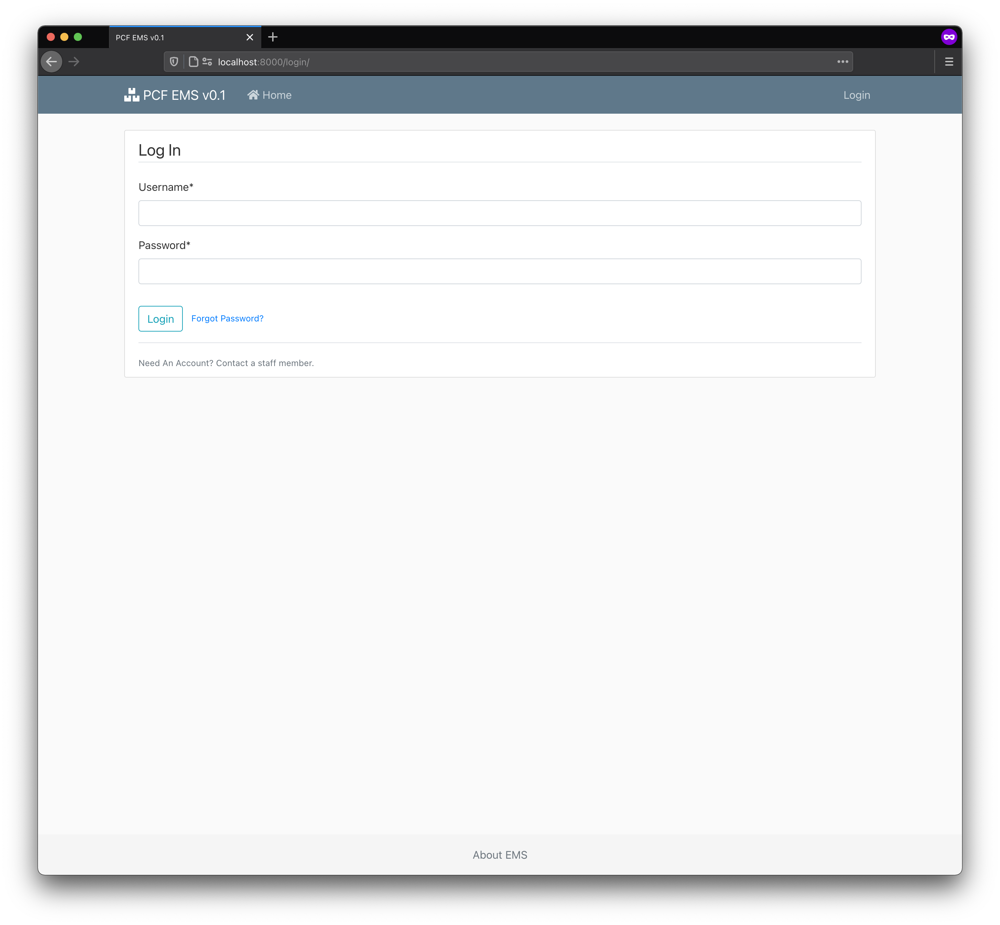Login</td>
        <td>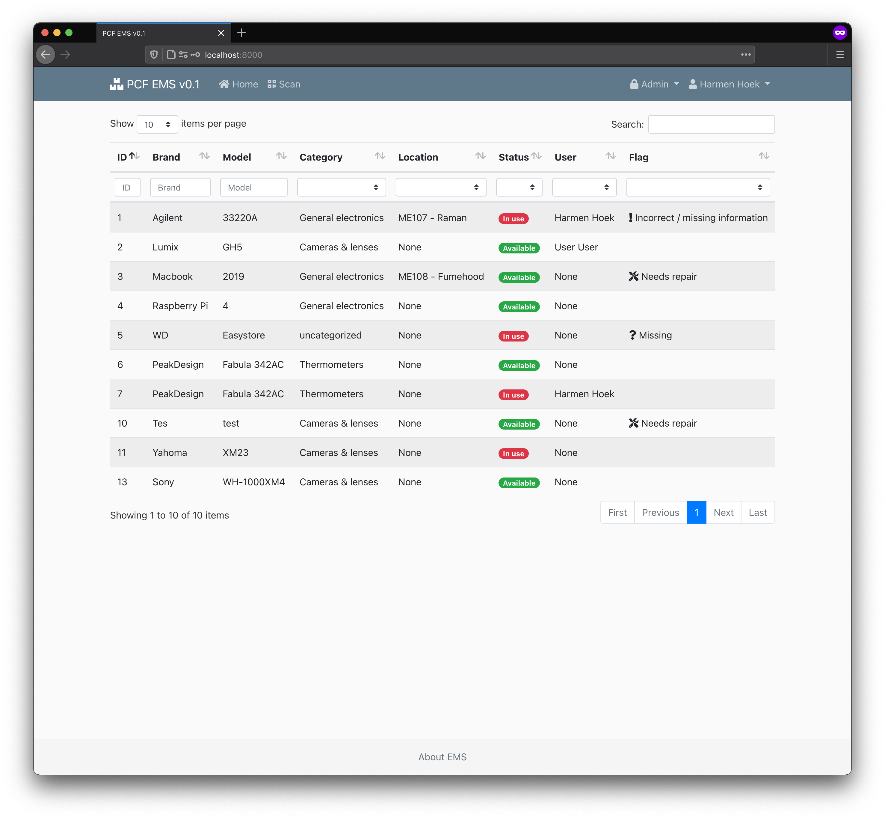Home view</td>
    </tr>
    <tr>
        <td>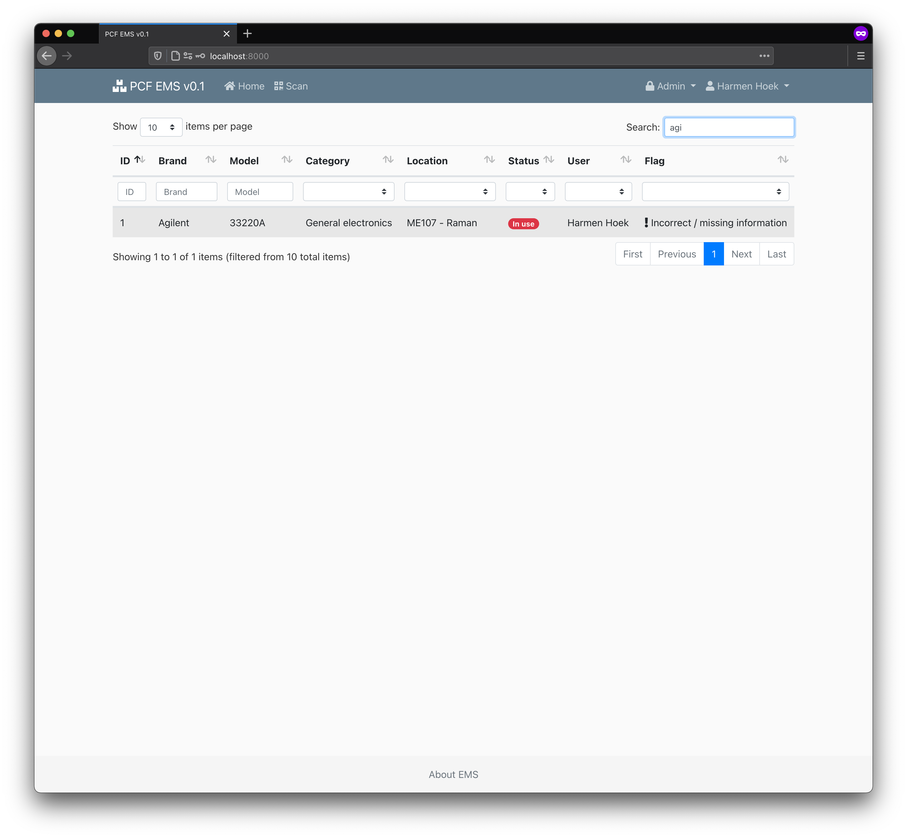Item search</td>
    </tr>
    <tr>
        <td>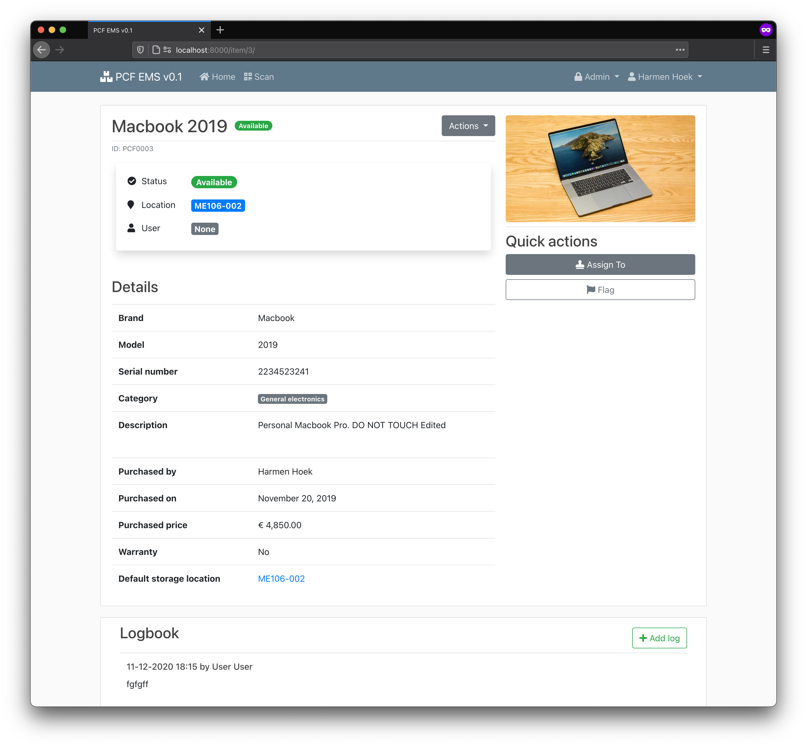Detail page (item available)</td>
        <td>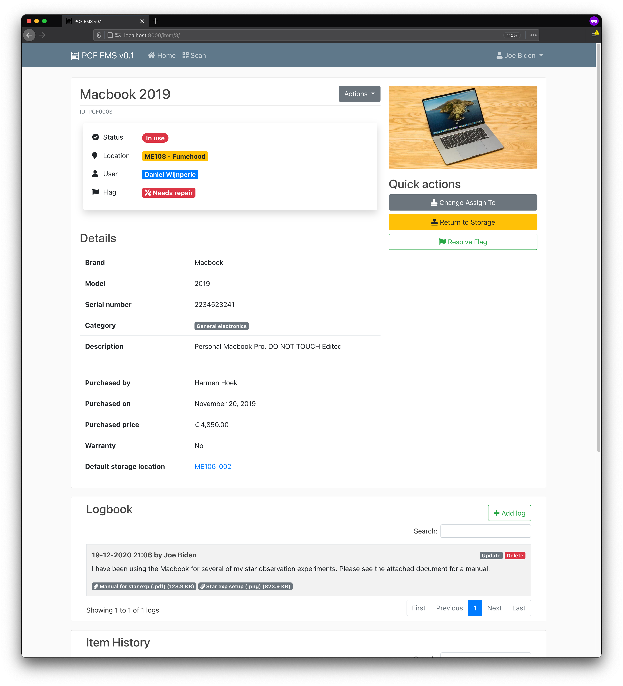Detail page (item in use)</td>
    </tr>
    <tr>
        <td>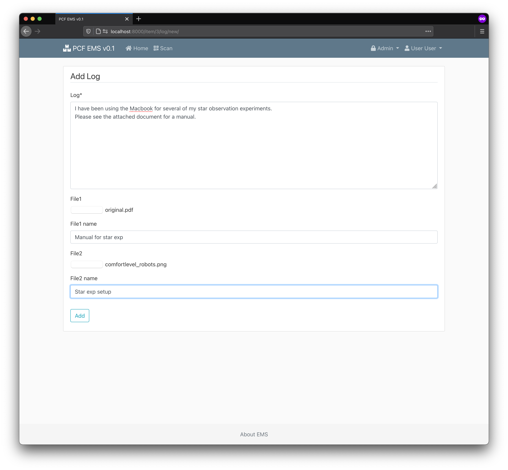Adding a log</td>
        <td>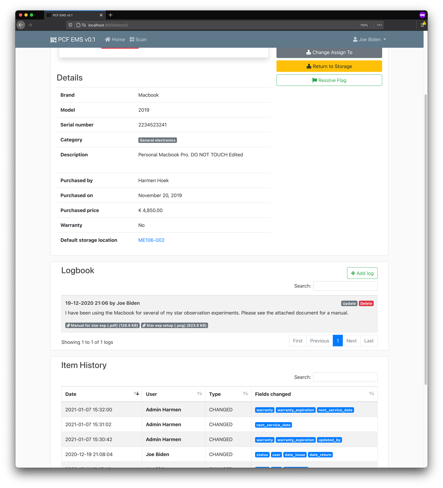Logbook overview</td>
    </tr>
    <tr>
        <td>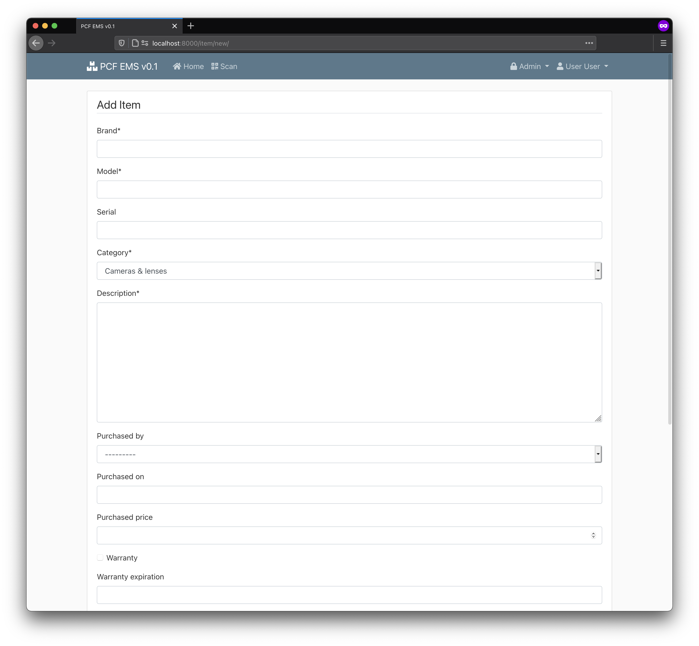Adding new item (staff only)</td>
        <td>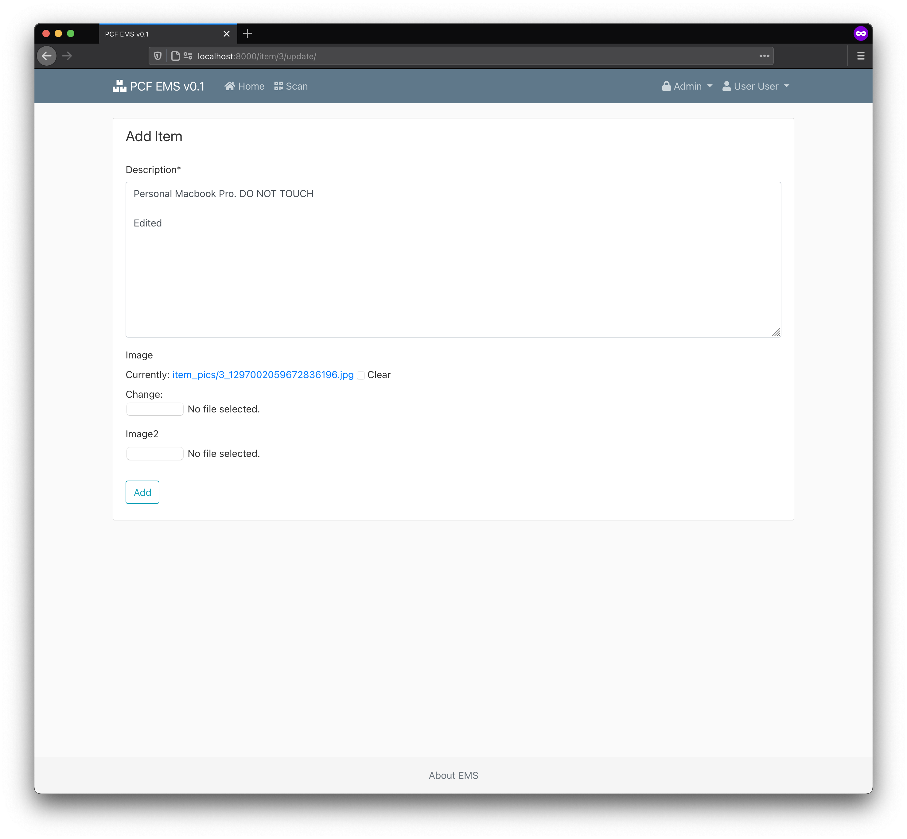Updating an item</td>
    </tr>
    <tr>
        <td>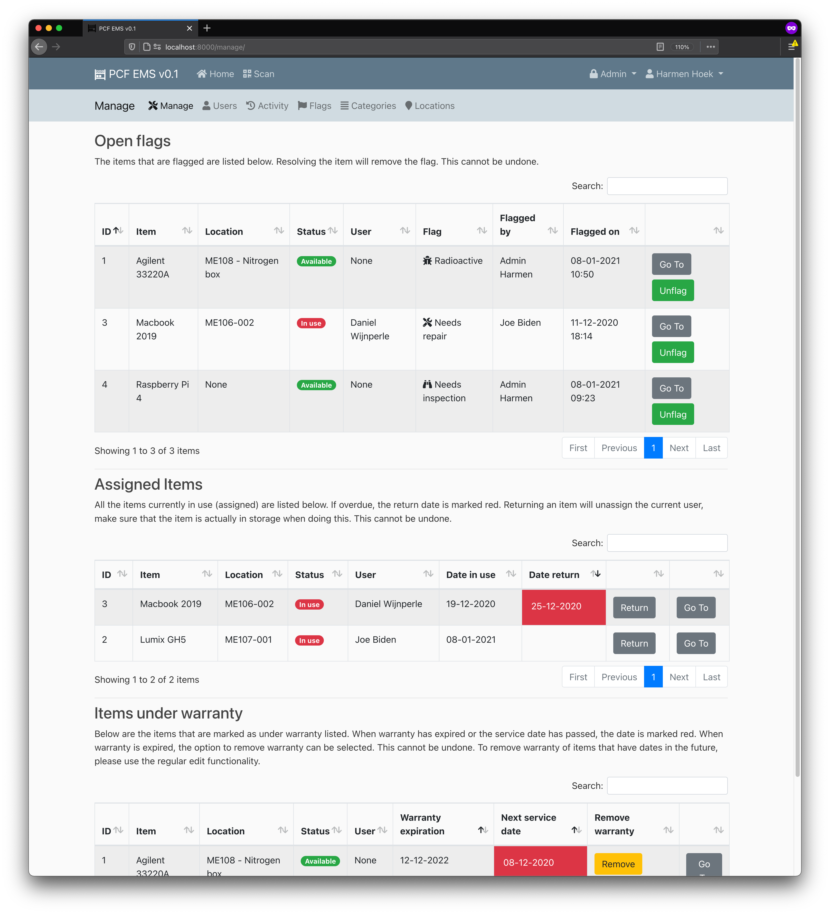Manage interface (staff only)</td>
        <td>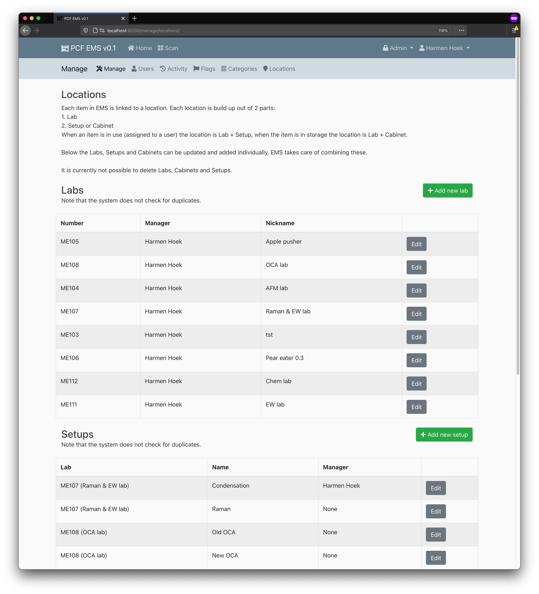Manage locations interface (staff only)</td>
    </tr>

</table> 

## Known bugs
- When adding or updating an item an error will show when warranty is set to true and only a exp date is given, no service date.

## Future feature list
- Bulk import csv for new items.
- Profile page extensions: see current items in use by a user.
- Export function for item.
- Generalize the code for use by other groups.